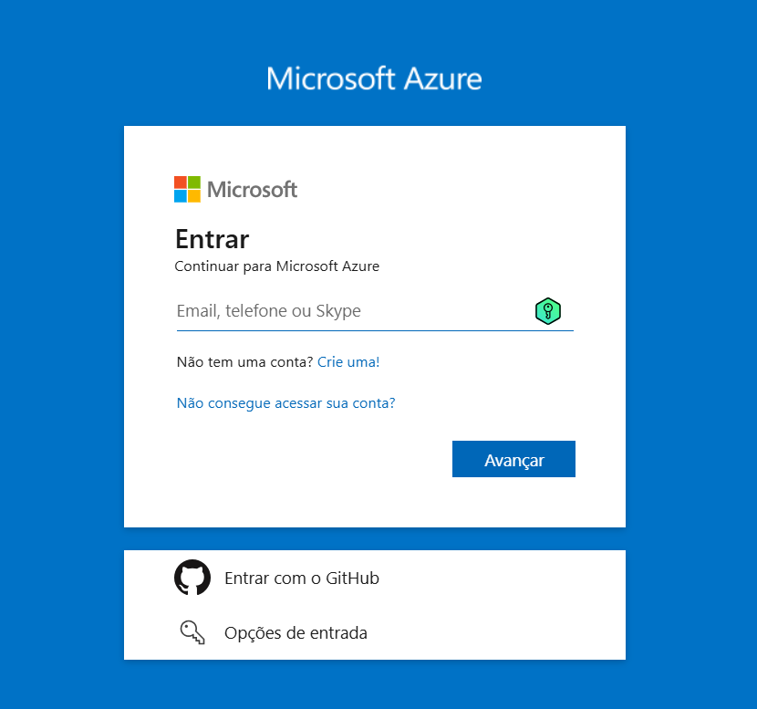
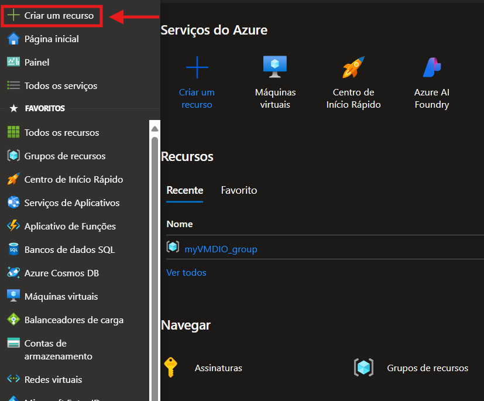
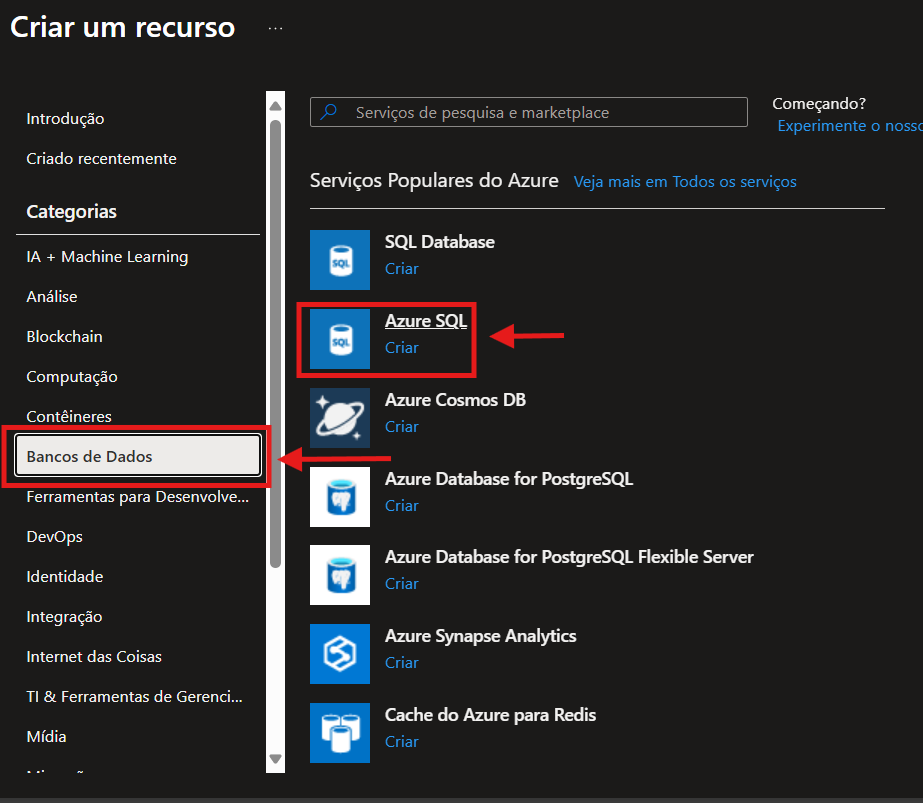
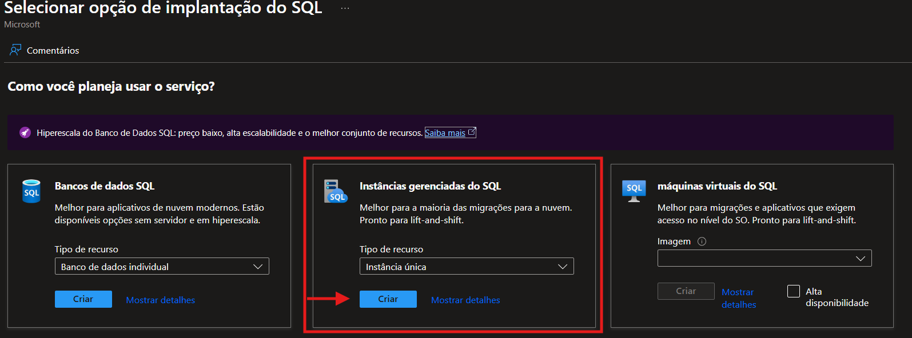
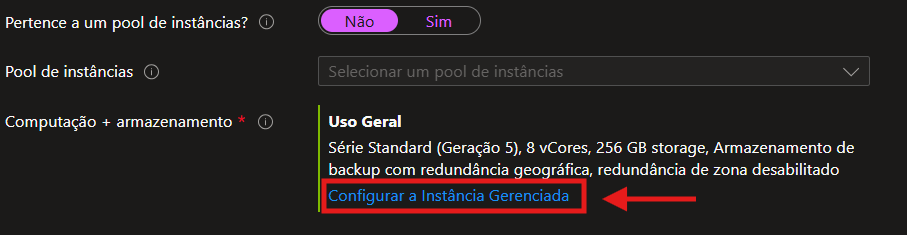
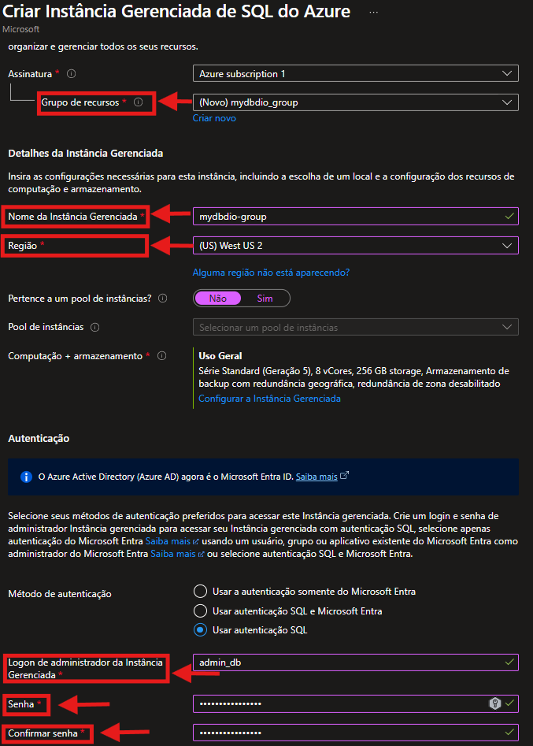
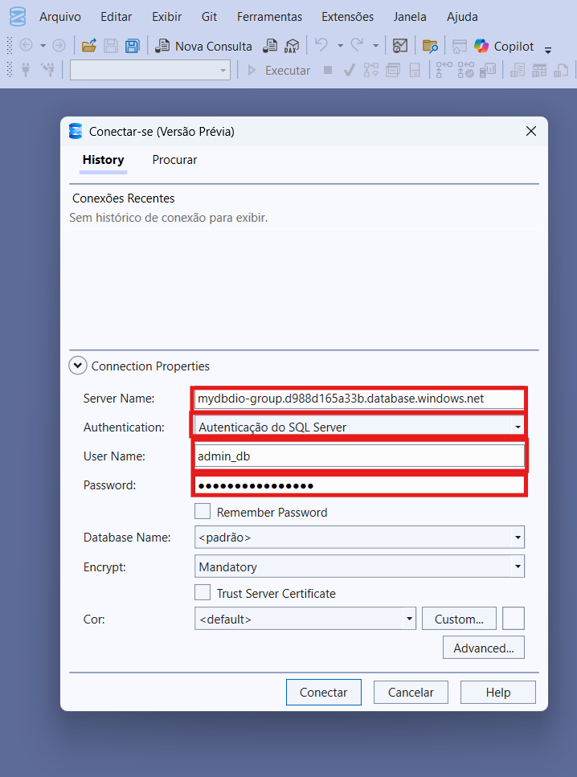

# 🛠️ Criação de uma Instância Gerenciada do Azure SQL

Este repositório documenta, de forma prática e detalhada, o processo de criação de uma **Instância Gerenciada do SQL no Microsoft Azure**, com base na documentação oficial da Microsoft. O conteúdo serve como apoio para estudos, testes e futuras implementações.

## 📚 Referência Oficial

> Guia utilizado como base:  
> [Criar uma instância gerenciada do Azure SQL - Início Rápido](https://learn.microsoft.com/pt-br/azure/azure-sql/managed-instance/instance-create-quickstart?view=azuresql&tabs=azure-portal)

---

## 📌 Sumário

- [Pré-requisitos](#pré-requisitos)
- [Passo a Passo](#passo-a-passo)
  - [1. Acessar o Portal do Azure](#1-acessar-o-portal-do-azure)
  - [2. Criar uma Instância Gerenciada](#2-criar-uma-instância-gerenciada)
  - [3. Configurar Rede Virtual](#3-configurar-rede-virtual)
  - [4. Criar a Instância](#4-criar-a-instância)
  - [5. Conectar-se ao SQL](#5-conectar-se-ao-sql)
- [Dicas Úteis](#dicas-úteis)
- [Imagens](#imagens)
- [Autor](#autor)

---

## ✅ Pré-requisitos

- Conta Microsoft com acesso ao [Azure Portal](https://portal.azure.com/)
- Permissões para criar recursos no Azure
- SQL Server Management Studio (SSMS) instalado (ou outra ferramenta compatível)

---

## 🛠️ Passo a Passo

### 1. Acessar o Portal do Azure

Acesse o [portal do Azure](https://portal.azure.com) e faça login com sua conta.

> 

---

### 2. Criar uma Instância Gerenciada

- No menu lateral, clique em **"Criar um recurso"**
- No menu lateral clique em **"Banco de Dados"**
- Selecione Azure SQL 
- Procure por **"SQL Managed Instance"**
- Clique em **"Criar"**

> 
> 
> 

---

### 3. Configurar Rede Virtual

- A instância exige uma **rede virtual (VNet)** dedicada.
- Você pode criar uma nova ou usar uma existente (desde que atenda os requisitos de sub-rede delegada).

> 

---

### 4. Criar a Instância

- Informe:
  - Nome da instância
  - Usuário administrador e senha
  - Tamanho da instância
  - Grupo de recursos e região
- Clique em **"Revisar + criar"** > **"Criar"**

> 

---

### 5. Conectar-se ao SQL

Após o provisionamento:

- Acesse a instância pelo portal
- Copie o nome do host
- Use o **SSMS** para conectar via login/senha do administrador

> 

---

## 💡 Dicas Úteis

- O provisionamento da instância pode levar até 6 horas, dependendo da configuração.
- A rede virtual precisa ser corretamente configurada com **sub-rede delegada ao SQL Managed Instance**.
- É possível configurar **firewall**, **backups automáticos** e **regras de acesso** logo após a criação.

---

## 🖼️ Imagens

As imagens capturadas durante o processo de criação estão na pasta [`/images`](images/). Elas ajudam a visualizar cada etapa descrita acima.

---

## 👨‍💻 Autor

Desafio prático de Microsoft Azure – Instância Gerenciada do SQL Server.  
Documentação elaborada por [Seu Nome Aqui].

---
